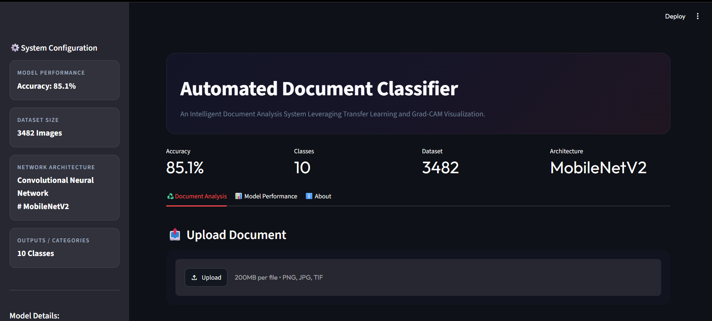
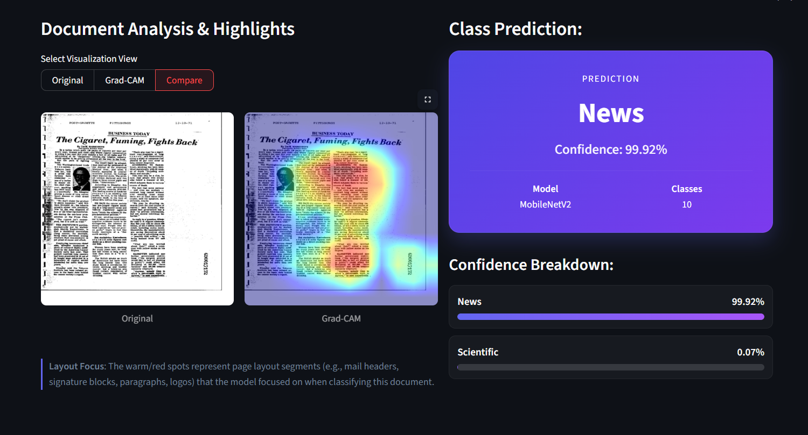

# Automated Document Classifier

A deep learning-based document image classification system built using **PyTorch**, **MobileNetV2 Transfer Learning**, and **Grad-CAM Explainable AI**.

The system classifies scanned document images into 10 different document categories based solely on visual layout patterns, eliminating the need for Optical Character Recognition (OCR).

---

## Live Demo
https://automated-document-classifier-2026.streamlit.app/

---
## Application Preview





---

## 🚀 Project Overview

Organizations process thousands of scanned documents every day, including:

- Emails
- Letters
- Reports
- Forms
- Scientific Papers
- Memos
- Resumes

Traditional OCR-based solutions are computationally expensive and often fail on:

- Low-quality scans
- Skewed documents
- Handwritten content
- Noisy images

This project solves the problem using a **visual layout classification approach**.

Instead of reading text, the model learns structural patterns such as:

- Headers
- Paragraph layouts
- Tables
- Signatures
- Multi-column formats
- Form grids

and automatically predicts the document category.

---

# 🎯 Features

✅ MobileNetV2 Transfer Learning

✅ Document Layout Classification

✅ 10 Document Categories

✅ Grad-CAM Explainability

✅ Interactive Streamlit Dashboard

✅ Class Imbalance Handling

✅ Precision-Recall Analysis

✅ Confusion Matrix Visualization

✅ Real-Time Inference

---

# 📊 Dataset

### Tobacco3482 Dataset

The project uses the benchmark Tobacco3482 document image dataset.

- Total Images: 3,482
- Classes: 10
- Format: Scanned Document Images

## Dataset Source

The original Tobacco3482 dataset is derived from the Truth Tobacco Industry Documents archive maintained by UCSF.


### Kaggle Dataset

https://www.kaggle.com/datasets/patrickaudriaz/tobacco3482jpg

> Note: The dataset is not included in this repository due to its size and licensing considerations. Please download it separately from Kaggle and place it inside the `data/` directory.


## Dataset Setup
Extract the dataset and organize it as:

data/
└── Tobacco3482/
    ├── ADVE/
    ├── Email/
    ├── Form/
    ├── Letter/
    ├── Memo/
    ├── News/
    ├── Note/
    ├── Report/
    ├── Resume/
    └── Scientific/

---

# 🏗️ System Architecture

```text
Input Document Image
        │
        ▼
Preprocessing
(Resize 384×384, Normalize)
        │
        ▼
MobileNetV2 Backbone
(Transfer Learning)
        │
        ▼
Global Average Pooling
        │
        ▼
Linear Classifier Head
        │
        ▼
10 Document Classes
        │
        ▼
Grad-CAM Heatmap Generation
        │
        ▼
Streamlit Dashboard
```

---

# 🔍 Explainable AI (Grad-CAM)

To improve model transparency, Grad-CAM is integrated into the prediction pipeline.

The heatmap highlights document regions responsible for predictions such as:

- Email Headers
- Signature Blocks
- Tables
- Form Grids
- Scientific Paper Columns

This helps users understand why the model made a specific classification.

---

# 🧠 Model Details

### Backbone

MobileNetV2 (ImageNet Pretrained)

### Transfer Learning Strategy

Frozen Layers:

```python
0 - 13
```

Fine-tuned Layers:

```python
14 - 18
```

Custom Classifier:

```python
1280 → 10
```


---

# 📈 Training Performance

| Metric | Value |
|----------|---------|
| Final Train Accuracy | 86.78% |
| Final Validation Accuracy | 79.94% |
| Test Accuracy | 85.10% |
| Macro F1 Score | 84.13% |
| Weighted F1 Score | 85.09% |

---

# 📊 Classification Results

| Class | Precision | Recall | F1 Score |
|---------|---------|---------|---------|
| ADVE | 0.9583 | 1.0000 | 0.9787 |
| Email | 0.9516 | 0.9833 | 0.9672 |
| Form | 0.9394 | 0.7209 | 0.8158 |
| Letter | 0.8772 | 0.8772 | 0.8772 |
| Memo | 0.8060 | 0.8710 | 0.8372 |
| News | 1.0000 | 0.9474 | 0.9730 |
| Note | 0.7619 | 0.8000 | 0.7805 |
| Report | 0.7000 | 0.7778 | 0.7368 |
| Resume | 0.9091 | 0.8333 | 0.8696 |
| Scientific | 0.5769 | 0.5769 | 0.5769 |

---

# 📉 Confusion Matrix

The confusion matrix shows strong performance across most categories.

Main confusion observed:

- Scientific ↔ Report
- Scientific ↔ Letter

Reason:

These document types often share:

- Similar paragraph structures
- Multi-column layouts
- Formal formatting styles

---

# 📈 Precision-Recall Performance

Average Precision (AP):

| Class | AP Score |
|---------|---------|
| ADVE | 0.9982 |
| Email | 0.9984 |
| Form | 0.9549 |
| Letter | 0.9610 |
| Memo | 0.9409 |
| News | 0.9950 |
| Note | 0.8803 |
| Report | 0.8392 |
| Resume | 0.9594 |
| Scientific | 0.6787 |

---

# 🖥️ Streamlit Application

The project includes a fully interactive Streamlit dashboard.

### Features

- Upload custom documents
- Predict document category
- View confidence scores
- Generate Grad-CAM heatmaps
- Compare original and heatmap images
- Test using sample dataset images

Launch:

```bash
streamlit run src/app.py
```

Or

```bash
run.bat
```

---

# 📁 Project Structure

```text
DOCUMENT_CLASSIFIER
│
├── src
│   ├── app.py
│   ├── train.py
│   ├── evaluate.py
│   └── utils.py
│
├── models
│   ├── document_classifier.pth
│   └── class_mapping.json
│
├── reports
│   ├── confusion_matrix.png
│   ├── precision_recall.png
│   ├── training_curves.png
│   └── evaluation_report.md
│
│
├── requirements.txt
├── run.bat
└── README.md
```

---

# ⚙️ Installation

Clone repository:

```bash
git clone https://github.com/NimilPGopal/tobacco3482-document-classifier.git

cd tobacco3482-document-classifier
```

Create virtual environment:

```bash
python -m venv venv
```

Activate:

### Windows

```bash
venv\Scripts\activate
```

### Linux / Mac

```bash
source venv/bin/activate
```

Install dependencies:

```bash
pip install -r requirements.txt
```

---

# ▶️ Running the Application

```bash
streamlit run src/app.py
```

---

# 🛠 Technologies Used

- Python
- PyTorch
- TorchVision
- MobileNetV2
- Streamlit
- NumPy
- Pillow
- Scikit-Learn
- Matplotlib
- Seaborn

---
