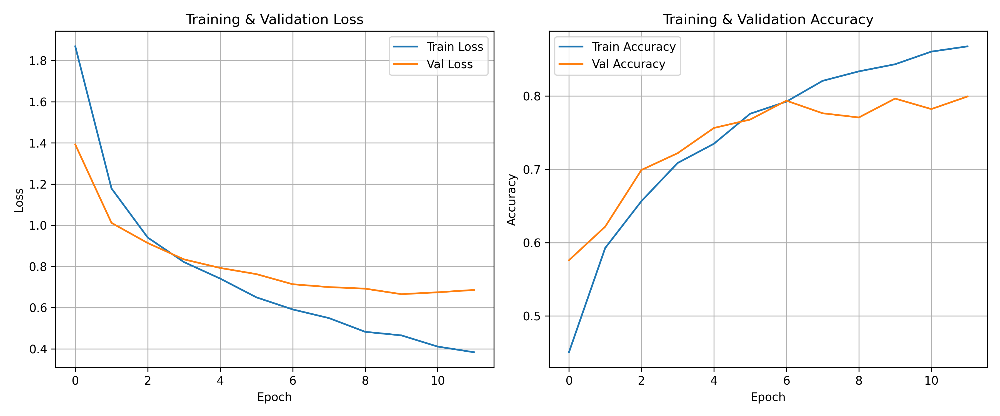
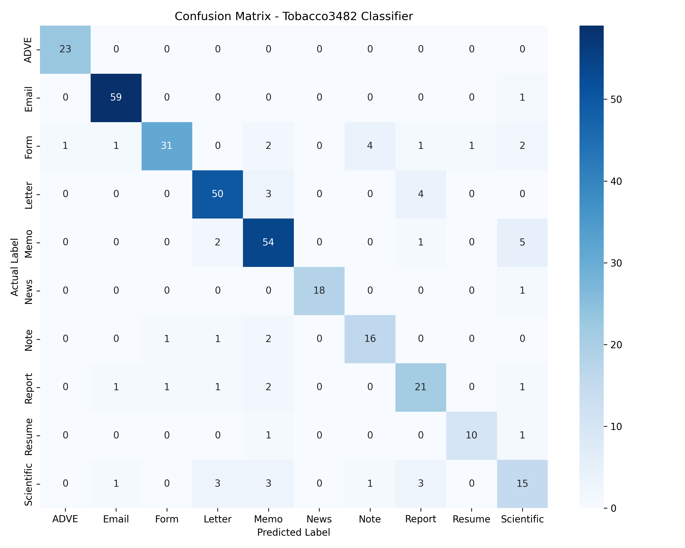
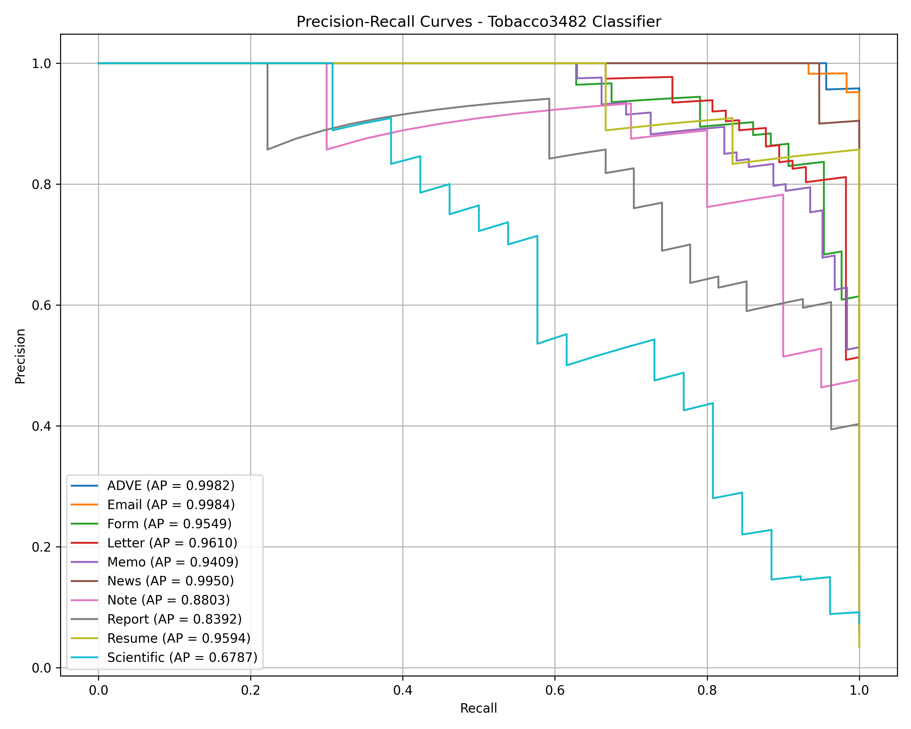

# Document Classifier Evaluation Report

This report presents the metrics and charts evaluating the trained MobileNetV2 document classifier.

### Summary Metrics:

- **Test Accuracy**: 0.8510
- **Macro Average F1-score**: 0.8413
- **Weighted Average F1-score**: 0.8509

---

### Training History:

Here is a summary of the model training over epochs:

| Epoch | Train Loss | Train Acc | Val Loss | Val Acc |
| :---: | :---: | :---: | :---: | :---: |
| 1 | 1.8687 | 0.4504 | 1.3919 | 0.5759 |
| 2 | 1.1787 | 0.5927 | 1.0114 | 0.6218 |
| 3 | 0.9400 | 0.6566 | 0.9135 | 0.6991 |
| 4 | 0.8211 | 0.7087 | 0.8342 | 0.7221 |
| 5 | 0.7408 | 0.7349 | 0.7925 | 0.7564 |
| 6 | 0.6497 | 0.7759 | 0.7625 | 0.7679 |
| 7 | 0.5911 | 0.7924 | 0.7134 | 0.7937 |
| 8 | 0.5491 | 0.8208 | 0.6996 | 0.7765 |
| 9 | 0.4824 | 0.8337 | 0.6920 | 0.7708 |
| 10 | 0.4651 | 0.8434 | 0.6652 | 0.7966 |
| 11 | 0.4107 | 0.8606 | 0.6743 | 0.7822 |
| 12 | 0.3833 | 0.8678 | 0.6856 | 0.7994 |

---

### Detailed Classification Report:

Below is the classification report showing Precision, Recall, and F1-score for each of the 10 classes.

| Class | Precision | Recall | F1-Score | Support |
| :--- | :---: | :---: | :---: | :---: |
| **ADVE** | 0.9583 | 1.0000 | 0.9787 | 23 |
| **Email** | 0.9516 | 0.9833 | 0.9672 | 60 |
| **Form** | 0.9394 | 0.7209 | 0.8158 | 43 |
| **Letter** | 0.8772 | 0.8772 | 0.8772 | 57 |
| **Memo** | 0.8060 | 0.8710 | 0.8372 | 62 |
| **News** | 1.0000 | 0.9474 | 0.9730 | 19 |
| **Note** | 0.7619 | 0.8000 | 0.7805 | 20 |
| **Report** | 0.7000 | 0.7778 | 0.7368 | 27 |
| **Resume** | 0.9091 | 0.8333 | 0.8696 | 12 |
| **Scientific** | 0.5769 | 0.5769 | 0.5769 | 26 |
| | | | | |
| **Accuracy** | | | 0.8510 | 349 |
| **Macro Avg** | 0.8480 | 0.8388 | 0.8413 | 349 |
| **Weighted Avg** | 0.8554 | 0.8510 | 0.8509 | 349 |

---

### Confusion Matrix:

The confusion matrix shows the true classes versus predicted classes. This helps analyze where the model confuses documents (for example, Letters vs. Memos).

---

## Precision-Recall Curves:

Precision-Recall curves measure the tradeoff between precision and recall for different thresholds. The higher the Area Under Precision-Recall curve (Average Precision, AP), the better the classifier performs on that category.

---
